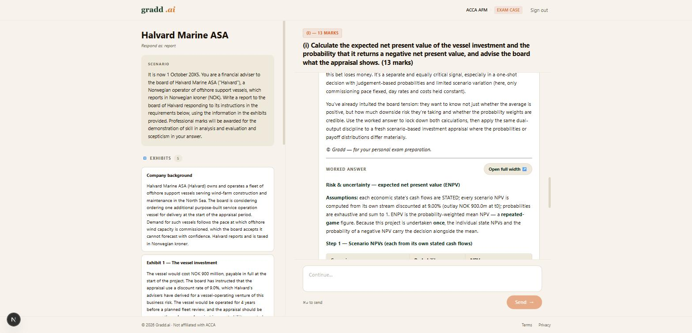
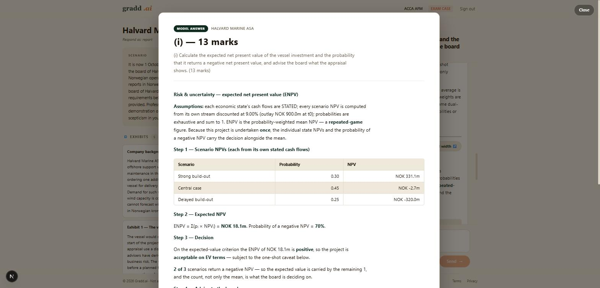
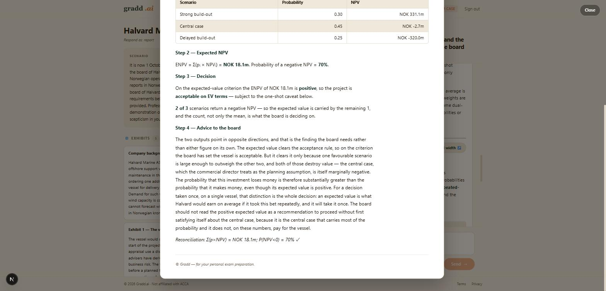

# KPMG demo — the hour, as the room will see it

**Status: REHEARSED 2026-09-06, WALKED ON SCREEN 2026-09-07.** Written as the document the
presenter reads on the day, not as a test result. Every wait is a real measured wait on
production (`https://www.gradd.ai`), not an estimate. Where a leg could not be walked, it says
so in the leg's own section rather than in a footnote.

**The hour is now TWO legs, not three.** Leg 3 — sitting a paper live and marking it in the
room — is **out** (see *Leg 3 is out of the hour*, below). The keyboard moment is **leg 2, the
case tutor**, which is what the one-pager actually promises: *"a trainee's answer marked, the
diverging step named."*

**What changed on 2026-09-07:** the sign-ins are solved and verified (Blocker 3 is closed),
legs 1 and 2 have been on a real screen rather than measured through the API, and leg 2 has
been run a second time so the two tutor faults are now n = 2 rather than n = 1.

**What changed LATER on 2026-09-07, and it changes how leg 2 is narrated:**

- ✅ **Turn 2's false absence is fixed and merged** (`20005b0`) — the tutor no longer tells the
  candidate they have not shown working they have shown. 11/30 → **0/40**, p < 0.001. It was
  *"the worst thing in the hour"*; it is not any more. ⚠️ Measured on the API, **not yet re-walked
  in a browser.**
- ✅ **The worked answer opens as a full-width page on one click** (`7d49832`, deployed
  `dpl_7DsxNN3WV1AWBK6Cb1C8cKu3CdQA`). **The leg-2 narration is no longer *"scroll past the
  wrapper"* — it is *"click expand."*** See *The click path, exactly* in LEG 2, and read the note
  on `Escape` / `Close` **before** you try it in front of people.

---

# WHAT THE PRODUCT DOES WELL — READ THIS BEFORE THE BLOCKER LIST

This section is first on purpose. Everything after it is seams and dress. **None of the
defects in this runbook is in the teaching or the marking**, and the two moments the hour is
sold on are both strong.

- **The hint on a partly-right answer.** Twice now, on a 250-word answer that is right about
  the judgement and wrong about one number, the tutor has named the error *class* and the
  *scenario* and given away neither the figure nor the direction — then asked the advisory
  question a reviewer would ask. **This is the beat the hour exists to reach.**
- **The marking discriminates, and explains itself.** On the seeded paper: `exemplary` 12/12
  on the requirement done at pace, `weak` 3/12 on the rushed one, with three specific errors
  named and the correct arithmetic shown. On the throwaway paper: `nothing` for a paragraph
  that asserted the right direction with no figures, `competent` for the one answer that did
  the work.
- **Professional-skills marking cites the candidate's own words.** The debrief closes with a
  per-case, per-skill panel that quotes the answer back in single quotes — *"you note that
  'the rate rests on a single proxy company, so it inherits whatever is idiosyncratic about
  that firm's gearing and operations'"* — against the paper's own descriptors. **This is the
  one-pager's "with the evidence cited", and it is on screen.** It was not in the 2026-09-06
  runbook at all because nobody had looked at the page.
- **The debrief routes.** It ends on a **`Practise my weak areas →`** button, which is the
  one-pager's last promise made good in one click.
- **The pacing engine reproduced an engineered profile** to within 0.05 on seven of eight
  ratios, and the collapse headline fired exactly where it was designed to.
- **Nothing lied under failure.** Through a gateway timeout, a partially-marked paper and a
  concurrent retry, the system reported `marked: false`, showed *"Not yet marked."* per
  requirement, refused to re-mark a case another request held, and did not double-bill.
- **The worked answer under the reveal is code-owned and shows its arithmetic** — a real
  table of scenario NPVs, the weighted sum, and a reconciliation line
  (`Σ(p×NPV) = NOK 18.1m; P(NPV<0) = 70% ✓`).

---

# 🟥 LEG 3 IS OUT OF THE HOUR

**Ruled 2026-09-07. This is a scoping decision, not a discovery — the measurement behind it is
Blocker 2 below, unchanged.**

Sitting AFM Mock Paper 1 live and marking it in front of the room **cannot be shown**, for
three reasons that compound:

| | |
|---|---|
| **Marking a full-length paper takes 220 s** | Measured on the seeded paper: 101 s for case 1 alone, all three done at 3 min 40 s. |
| **The gateway cuts at ~100 s** | Cloudflare's origin timeout in front of Vercel. Not configurable below Enterprise. |
| **The recovery is non-deterministic** | A retry pressed immediately after the error finds one, two or three cases marked. The intermediate screen is not a fixed screen, so it cannot be rehearsed. |

So the room would watch two minutes of *"Marking did not complete… try again"*, then a
partially-marked paper reading `—/20`, then — if the presenter pressed retry a second time and
waited — the correct debrief. **Roughly three minutes to a correct band, two of them spent
looking at an error message.** That is not a demonstration of the product; it is a
demonstration of the seam.

**What replaces it.** Leg 1 already shows a marked paper, and it shows a *better* one: a full
3-hour sitting with full-length answers, which is the condition a live sit could never reach
inside the hour anyway. **The marking is still demonstrated — it is demonstrated from the
debrief, not from the clock.**

**The presenter still needs a line for it**, because the room will ask whether a trainee sits
the paper in the product. Say: *"They sit it on our clock, three hours fifteen, and it marks
as one paper. What you're looking at is the output of one of those. We're not going to sit a
three-hour paper in a half-hour meeting."*

⚠️ **Do not improvise a shortened sit instead.** A fast paper always produces the
*End-of-paper collapse* headline regardless of how it went (see Leg 3's own section), so a
rattled-through paper is accused of collapsing at the end — in front of the room, on a screen
whose whole point is that the diagnosis is trustworthy.

**The fix is scoped as a separate item and is NOT a demo problem** — it is live for students
today. See `docs/AFM_SURFACED.md`, *"Marking is synchronous behind a 100-second gateway."*

---

# 🔴 BLOCKER 1 — SIGNING IN THE DEMO ACCOUNTS FAILS SILENTLY, AND THE FAILURE LOOKS LIKE SUCCESS

**Found 2026-09-06 while setting up the rehearsal. Read this before touching the browser on
the day.**

## What happens

An **admin-generated magic link** — the kind you get from the Supabase dashboard's
"Generate link", or from `auth.admin.generateLink()` in a script — **does not sign you into
the app.** It is an *implicit-flow* link: the token comes back in the URL **fragment**
(`https://www.gradd.ai/acca#access_token=eyJhbGci…`).

`app/auth/callback/route.ts` reads **only** `?code=` — the PKCE parameter. There is no
fragment handler anywhere on `/acca`. So the token in the address bar is read by nothing.

## Why it is dangerous rather than merely broken

**There is no error.** The browser lands on a fully-rendered, signed-in `/acca` dashboard, and
the session it is showing is **whoever was signed in before**. Observed in rehearsal: the URL
carried demo account `01afea07`'s access token while every API call on the page authenticated
as `grant@live.ie`. Nothing on screen said so.

On the day that means **presenting on the wrong account without knowing** — most likely on
Grant's own account, which currently has **no ACCA entitlement** and shows the amber
*"All 3 free teach-throughs used"* banner. Leg 2 and leg 3 would both hit an upsell wall in
front of the room, and the natural on-the-spot diagnosis ("the entitlement didn't apply") would
be wrong, so the natural fix (re-grant the entitlement) would not work either.

## The sign-in step

**The addresses and the click path are in *The sign-ins* section above.** The one rule this
blocker imposes on it: **use the link from the email and nothing else.**

## How to verify WHICH account is live, on screen, before anything else

⚠️ **No ACCA surface displays the signed-in email address.** This was checked: the only pages
in the whole app that render `user.email` are under `/admin`. So there is no glance-at-the-
header confirmation, and you need one of the two checks below.

**Check A — entitlement, on screen, no developer tools.** Go to
`https://www.gradd.ai/acca/cases?paper=AFM`. Look at the case cards:

| What you see on the cards | What it means |
|---|---|
| **`Start case →`** | ✅ You are on an entitled demo account. Proceed. |
| **`🔒 Subscribe to unlock`** | ❌ Wrong account — almost certainly still Grant's. Go back to step 1. |

**Check A does not distinguish demo1 from demo2 from demo3** — all three are entitled and look
identical. For leg 3, where the spare matters, use check B.

**Check B — identity, definitive.** Pre-flight only; never with the room watching. Open
DevTools (`F12`) → Console, on any `www.gradd.ai` page, and paste:

```js
(() => { const p = document.cookie.split(';').map(c => c.trim())
  .filter(c => c.startsWith('sb-uomxsbagekubfvkukokj-auth-token')).sort();
  let r = p.map(c => c.slice(c.indexOf('=') + 1)).join('');
  if (r.startsWith('base64-')) r = r.slice(7);
  return JSON.parse(atob(JSON.parse(atob(r)).access_token.split('.')[1])).email; })()
```

It prints the signed-in email. Close DevTools afterwards.

## Two side effects of pre-authenticating, so they don't surprise you

- **Each first sign-in fires a "new signup" alert to Grant's inbox** and appends `?signup=1`
  to the URL (`isNewSignup` in the auth callback keys on `last_sign_in_at − created_at < 10min`,
  and these accounts were created minutes before). Three accounts, three alerts. Harmless, but
  don't read them as real signups.
- The `?signup=1` is visible in the address bar after sign-in. Navigate once more before
  presenting so the URL reads cleanly.

---

# ✅ THE SIGN-INS — RESOLVED 2026-09-07 (was Blocker 3)

**Three addresses, all on `gradd.ai`, all minted with AFM + APM entitlements running to
2026-12-31.** Use them one at a time.

| Address | Role on the day | Account id |
|---|---|---|
| `grant+demo1@gradd.ai` | **Leg 2 — the practice case.** Keep it virgin until the day. | `a02c4c82` |
| `grant+demo2@gradd.ai` | Spare for leg 2 (if a turn goes wrong, switch rather than retry). | `b453e96d` |
| `grant+demo3@gradd.ai` | Second spare / anything ad-hoc. | `3b742fcc` |

**They deliver to `grant@gradd.ai`.** Zoho supports plus-addressing, so everything after the
`+` is a tag and the mail lands in the mailbox you already open.

## The deliverability was verified before you were handed the addresses

Probed against `mx.zoho.eu` on 2026-09-07, `RCPT TO` on each:

| Address | Zoho's answer | Means |
|---|---|---|
| `grant@gradd.ai` | `541 5.7.1 Mail rejected due to antispam policy` | **Mailbox EXISTS.** Zoho resolved the recipient, then refused *my* probe's IP — which is the point of the test. |
| `grant+demo1@gradd.ai` | `541 5.7.1 …antispam policy` | **Resolves to the same mailbox.** Plus-addressing is on. |
| `zz-nobody-77+tag@gradd.ai` | `550 5.1.1 User does not exist` | **There is no catch-all.** The 541s above are real recipients, not a domain that accepts everything. |
| `demo1@gradd.ai` | `550 5.1.1 User does not exist` | ⚠️ **The 2026-09-06 runbook told you to create these. Do not — they do not exist and would bounce.** The plus form needs no Zoho work at all. |
| `info@` · `admin@` · `support@` | `550 5.1.1 User does not exist` | For completeness. `hello@gradd.ai` does exist. |

**A real magic link was sent to `grant+demo1@gradd.ai` at 10:12 UTC on 2026-09-07** through the
app's own path (`signInWithOtp` with the production redirect), and Supabase accepted it. **The
one hop that could not be verified from here is Supabase's mailer actually landing it** — check
`grant@gradd.ai` (and its spam folder) for a *"Sign in to Gradd"* mail before the day. If it is
not there, that is a Supabase SMTP problem, not an address problem, and the address list above
is still right.

📌 **A correction to the 2026-09-06 runbook, because it changes what you believe about the old
accounts.** It recorded *"Grant reports he does not have these addresses"* for
`grant+demoN@live.ie`. Probed against `eur.olc.protection.outlook.com`:
`grant+demo4@live.ie` → **`250 2.1.5 Recipient OK`**, `zz-nobody-8842@live.ie` → `550`. Outlook
plus-addressing works too, and delivers to `grant@live.ie`. **So the existing rehearsal
accounts were reachable all along** — including `grant+demo4@live.ie`, which carries leg 1's
seeded sit. Nothing needs re-minting.

## The click path, one at a time

Do this **before the room sits down**, once per account. It is three minutes each.

1. **Sign out** in the `/acca` header. It lands you on the public landing page at `/` — *not* a
   login screen. That is correct (`PRODUCT_PUBLIC_HOME.ACCA = '/'`), not a fault.
2. **Type `https://www.gradd.ai/acca/auth` into the address bar.** Nothing on the landing page
   routes you there.
3. Type the address into the single email field and press **`Send sign-in link →`**. The screen
   changes to *"Check your email"*.
4. Open the mail in `grant@gradd.ai`, click the link. **Use the link from the email and nothing
   else** — it is a `?code=` link and it is the only kind that works (Blocker 1).
5. You land back on `/acca`, signed in.
6. **Confirm the account took**, using Check A in Blocker 1: go to
   `https://www.gradd.ai/acca/cases?paper=AFM` and look at the cards. **`Start case →`** = right
   account. **`🔒 Subscribe to unlock`** = still Grant's, go back to step 1.

## The accounts that exist right now

| Account | State | Keep? |
|---|---|---|
| `grant+demo1@gradd.ai` | **Virgin.** Entitled to 2026-12-31. | Leg 2 on the day |
| `grant+demo2@gradd.ai` | **Virgin.** Entitled to 2026-12-31. | Spare |
| `grant+demo3@gradd.ai` | **Virgin.** Entitled to 2026-12-31. | Spare |
| `grant+demo4@live.ie` | **Carries the seeded AFM sit** (leg 1) **and Halvard Marine (i) is now spent on it** by the 2026-09-07 leg-2 walk. Entitlement extended from 2026-09-09 to 2026-12-31. | **Do not delete** |
| `grant+demo1@live.ie`, `grant+demo3@live.ie` | Old rehearsal accounts, partly spent. | Ignore |
| `grant@live.ie` | Your own. **No ACCA entitlement**, shows the amber *"All 3 free teach-throughs used"* banner. It **is** the org coordinator. | Coordinator view only |

⚠️ **The entitlements on `grant+demo4@live.ie` were about to expire on 2026-09-09** — two days
after this was written. They now run to 2026-12-31. Had that gone unnoticed, leg 1 would have
hit a paywall on the day.

⚠️ **Never sit a paper on `grant@live.ie`.** A sit is one per account, permanently —
`app/api/acca/case/turn` returns 409 `already_submitted` and will not overwrite. It would spend
your own account's AFM mock for good.

---

# 🔴 BLOCKER 2 — MARKING SUCCEEDS AND THE STUDENT IS TOLD IT FAILED

**This is the most serious thing found in the rehearsal, and it is not a demo problem — it is
live for students today.** It is the measurement behind *Leg 3 is out of the hour* at the top
of this document, and the fix is scoped as its own item in `docs/AFM_SURFACED.md` (*(m)
Marking a sat paper is synchronous behind a 100-second gateway*). It is on the path every time
and it is not intermittent.

📌 **A real student has already hit it.** Aubrey's APM sitting of 2026-09-01 finished at
02:07:40 UTC and its three cases were marked at **+122 s, +201 s and +204 s** — every one past
the ~100 s ceiling. See the provenance block at the top of leg 1.

## What happens

At the end of a sat AFM paper the client POSTs `/api/acca/sit/results` to mark it. Measured on
production, 2026-09-06, on a real 8-requirement sitting with real answers:

```
POST /api/acca/sit/results   →  HTTP 524, empty body, after 125 seconds
```

**524 is Cloudflare's origin-timeout.** `www.gradd.ai` runs Cloudflare in front of Vercel
(`Server: cloudflare` + `x-vercel-id` on the same response), and Cloudflare cuts a connection
when the origin has been silent for ~100 s. It is not configurable below Enterprise.

**The Vercel function does not stop when Cloudflare hangs up.** It keeps marking. Timestamps
from `acca_case_marking`, same run:

| | |
|---|---|
| Paper finished | 20:21:43 |
| Case 1 marked | 20:23:10 |
| Case 2 marked | 20:23:57 |
| **Cloudflare returns 524** | **~20:23:49** |
| Case 3 marked | **20:24:46** — *57 seconds after the browser was told it failed* |

**So marking succeeds and the student is told it failed.** Three cases at roughly 45–50 s each
is ~150 s of work against a ~100 s ceiling; the paper is structurally over the limit, not
marginally.

## ⚠️ IT IS MUCH WORSE ON A REAL PAPER — THE BETTER THE ANSWERS, THE SLOWER THE MARKING

Reproduced independently the same night on the **seeded** sitting, whose eight answers are
full exam length (960–1,867 characters each) rather than the short paragraphs above:

| | |
|---|---|
| Paper finished | 22:08:53 |
| Case 1 marked | 22:10:34 — **101 s for one case** |
| **Cloudflare returns 524** | **22:10:58** |
| Case 2 marked | 22:11:23 |
| Case 3 marked | **22:12:33** |

**Total marking: 3 minutes 40 seconds — 220 seconds against a ~100 second ceiling.** The
earlier 125 s figure came from a paper of short paragraphs and *understates* the problem.

Two consequences worth being precise about:

- **A good paper is the slow case.** Marking time scales with how much the candidate wrote, so
  the demo condition — a properly answered paper — is the one furthest over the limit. You
  cannot escape this by writing better answers; that makes it worse.
- **The recovery is not the same every time.** On the short paper the function had finished all
  three cases 57 s after the cut. On the full paper only case 1 was done at the cut, case 2
  landed 25 s later and case 3 a further 70 s after that. **A retry pressed immediately after
  the error can find one, two or three cases marked**, so the intermediate "Not yet marked."
  state is not a fixed screen — it depends on when the button is pressed.

## What the presenter will see, in order

`resultsOutcomeFor(status, code)` maps anything that is not 2xx/402/409 to `failed`, so a
524 with an empty body lands on the error arm.

| # | On screen | Wait | Reality |
|---|---|---|---|
| 1 | *"Marking your paper…"* | **125 s** | Working correctly |
| 2 | **"Marking did not complete… try again"** + a **Try marking again** button | — | It is completing |
| 3 | Press retry → the debrief loads in **3 s**, but **Q3 (i) and Q3 (ii) read "Not yet marked."** and the case total reads **`—/20`** | 3 s | The third case is still being marked by the first request |
| 4 | Press retry again a minute later → **the complete, correct debrief** | 2 s | Everything was marked at 20:24:46 |

**Roughly three minutes from the last answer to a correct band, two of them spent looking at an
error message, with a partially-marked paper in between.** That is the moment the hour exists
to reach.

## Three things that are working, and should not be confused with the fault

- **The system never lies.** `claimCase` writes the claim row with `technical_marks_available`
  NULL, so a claim can never read as a result; the intermediate debrief says **"Not yet
  marked."** per requirement and returns `marked: false`, `skipped_concurrent: 1`. It reports a
  partial paper as partial.
- **Nothing is lost and nothing is double-billed.** The retry at step 3 marked *nothing*
  (`marked_now: 0`) — it correctly refused to re-mark a case another request was working on.
- **The claim self-heals.** `CLAIM_STALE_MS` is 5 minutes, so a genuinely crashed run is taken
  over by the next request rather than blocking the case forever.

The defect is entirely that **the front door gives up before the kitchen does**, and the UI has
no way to know the difference.

## On the day

**Superseded — leg 3 is cut.** Nothing in the hour reaches this path. Leg 1 opens an
already-marked debrief from `/acca/results`, which never marks and never spends.

**Do not "fix" this by shortening the answers.** A shorter paper marks faster and hides it. The
condition is a full paper, which is the product.

---

# 🔴 BLOCKER 4 — THE SEED THAT PRODUCES LEG 1's DATA CANNOT SURVIVE ITS OWN RUNTIME

**Found by running it. `scripts/seed-demo-sit.ts` had never been executed before tonight, and
this is why leg 1 has never had data.**

## What happened

Started 19:19 UTC. R1–R4 submitted correctly at 19:53, 20:35, 20:56 and 21:09. At **21:33**,
2h14m into a 2h47m run, R5 failed:

```
✖ FAILED: turn → 401 Unauthorised
  State is in the DB — re-run the same command to resume from where it stopped.
```

## Why

`mintCookie()` mints **one** session at startup and the script then sends that same static
cookie string on every request for the next three hours. A Supabase access token lives one
hour. After it expires the route's own `createServerClient` refreshes using the refresh token
inside the cookie and **rotates it**, setting new cookies on the response — which the script
discards, because it never reads `set-cookie` back into its jar.

So from roughly the one-hour mark the script is replaying an already-consumed refresh token.
GoTrue's reuse-interval tolerates that for a while, which is why R2 (76 minutes in), R3 and R4
all succeeded. Then the grace ran out and the token was rejected.

**Any run longer than about two hours will hit this.** The script's own header says the 2h47m
duration is unavoidable — the pacing has to be performed — so the failure is on the path every
single time.

## The dangerous part is the recovery, not the failure

The script resumes correctly: it reads which requirements already carry a `final_answer` and
skips them without re-waiting. **But the pacing intervals are wall-clock gaps between HTTP
requests, so every minute the run is down is added to the next requirement's interval.**

R4 landed at 21:09:42. R5's budget is 23.4 minutes and `RATIO_FLAG_BAND` is ±25%, so R5 had to
be submitted between **17.6 and 29.3 minutes** after R4 — a hard deadline of **21:39:00** —
or its flag would flip from `on budget` to `over`.

**R5 is one of the two requirements the narration walks.** The plan's whole point is that R5
reads `on budget 1.03` and R7 reads `under 0.51` — the same candidate, holding pace and then
losing it. An `over` at R5 destroys that contrast and there is no way to re-take it, because
submissions are immutable.

It was recovered with about four minutes to spare: R5 was submitted by hand at **21:34:59**,
25.3 minutes after R4 → **ratio 1.08, `on_budget`**. The plan wanted 1.03. Inside the band,
and pure luck that the failure was noticed in time.

## What this means for anyone re-running it

- **Do not start the seed unattended and walk away.** Watch it, or the first 401 silently
  costs you the pacing profile that is the entire reason for the 2h47m.
- **If it dies, the clock on the next requirement is already running.** Work out the deadline
  before doing anything else: budget = `marks × 1.95` minutes, and you have ±25% of that from
  the last successful submission.
- **The real fix is small**: read `set-cookie` off each response back into the jar, or re-mint
  the cookie before every submission (`mintCookie` is cheap — one `generateLink` plus one
  `verifyOtp`). Re-minting per requirement is the simpler of the two and has no downside here.
  **Not done — this rehearsal fixes nothing.**

---

# SETUP — before the room sits down

## The warm-up, measured

Measured on production, real routes, real model calls, 2026-09-06 19:22 UTC.

| Call | Wait | What it is |
|---|---|---|
| `GET /api/acca/case` (load a case) | **2.1 s** | Page + scenario + exhibits |
| `POST /api/acca/case/turn` #1 | **6.7 s** | First coached turn — returned a `hint` |
| `POST /api/acca/case/turn` #2 | **8.1 s** | `teaching` |
| `POST /api/acca/case/turn` #3 | **7.0 s** | `teaching` |

**There is no cold-start cliff to warm away.** Turn #1 was the *fastest* of the three, so the
6–8 seconds is the model thinking, not the platform waking up. Warming up does not shorten the
waits — **it only confirms the room's network reaches production.** Do it anyway, on the
throwaway case (below), five minutes before you start.

⚠️ **PLAN YOUR NARRATION AROUND 6–8 SECONDS OF SILENCE PER TURN.** Leg 2 is three turns plus a
reveal — call it **30 seconds of dead air across the leg**, in four chunks. That is a long time
in a room. The per-screen sections below give you a line to say into each wait.

**Warm up on `Kestrel Foods plc`, never on the case you are about to demo.** A coached turn
spends the requirement's first-miss state, and the first miss is what produces the *hint* —
demo the same case you warmed on and the tutor opens in `teaching`, skipping the beat leg 2
exists to show.

## 🟠 The window — and the geometry is NOT the same on every surface

**Corrected 2026-09-07 by measuring all three surfaces on the live DOM at a 1920 CSS px
viewport.** The 2026-09-06 runbook applied one figure to the whole product; it is only true of
one page.

| Surface | Content width | Share of a 1920 px window | Verdict |
|---|---|---|---|
| `/acca` dashboard | `main` **720 px**, cards **656 px** | **34%** | 🟠 The narrow strip. This is the surface the original measurement found. |
| `/acca/results/<id>` (leg 1) | **1040 px**, pacing table **950 px** | **54%** | ✅ Fine. Nothing to fix. |
| `/acca/cases/<id>` (leg 2) | Two-pane, full width | ~100% | ✅ Fine. Looks like a product. |

**So the fix is smaller than it looked.** The two legs you are actually presenting are both
well-proportioned. The narrow strip is the `/acca` dashboard, which is a transit screen.

Still worth doing, and it takes two seconds:

- **Zoom to 125–150%** (`Ctrl` `+`). The body copy is **16 px**; from the back of a meeting room
  that is the real problem, not the margins.
- Do it once at the start and leave it. Changing zoom mid-demo is visible and looks like
  fumbling.

⚠️ **`resize_window` did not take on the presenting machine** — the window stayed at 1920 CSS
px (2560 px screen) despite being asked for 1400. Set the window by hand and confirm with the
actual projector before the room arrives; do not assume a resize landed.

## 🔴 The tutor transcript is read through a 279-pixel letterbox

⚠️ **A FIX IS WRITTEN AND NOT YET MERGED — branch `fix/demo-legibility-and-strong-action`.**
Everything in this section describes **production as it stands today**. If that branch has
merged and deployed by the time you present, the transcript is **384 px** at this window
instead of 279 (and the composer 148 px instead of 227) — check which state you are in before
rehearsing the scroll, because the two need different handling. Measured before/after at three
viewport heights:

| Viewport height | Transcript today | With the fix | |
|---|---|---|---|
| **755 px** (the presenting machine) | 279 px | **384 px** | +38% |
| 800 px | 324 px | **429 px** | +32% |
| 1080 px | 604 px | **673 px** | +11% |

The relative gain is largest where it hurts most, because most of it comes from the composer no
longer holding five rows when it is empty — a fixed cost that a short viewport cannot afford and
a tall one barely notices.

**Measured on the live case surface, 2026-09-07.** The transcript pane (`.ec-messages`) is
**279 px tall** and held **3,544 px** of conversation by the end of leg 2 — a ratio of about
**12.7 : 1**. Meanwhile the empty composer box beneath it takes ~150 px.

**Consequences for leg 2, which is now the keyboard moment of the hour:**

- The hint is ~15 lines. **About six are visible at a time.** This is unchanged and it is still
  the beat the room reads through the letterbox.
- ✅ **The REVEAL no longer has to be read this way (2026-09-07).** It used to be the worst case —
  the room saw roughly a sixth of the message before the presenter had to scroll inside a
  scrollbox with its own scrollbar, separate from the page's. The worked answer now opens as a
  full-width document on one click; see *The click path, exactly* in LEG 2. **The letterbox still
  governs everything else in the transcript**, including the hint above and the wrapper the
  expand control sits under.
- Scrolling with the cursor over the left-hand scenario pane scrolls the *page*, not the
  transcript. **Put the cursor over the transcript before you scroll**, or the wrong thing
  moves in front of the room.

**Mitigation, in order of preference:** make the browser window **taller** (the pane is sized
off viewport height, so height buys transcript and width does not) · run with the bookmarks bar
hidden and in full screen (`F11`) · and rehearse the scroll so it is one smooth movement rather
than three corrections.

## 🟠 `⌘↵ to send` — Mac glyphs on a Windows machine

The composer's hint text under the send button renders **`⌘↵ to send`** on the presenting
Windows machine. Small, but it is directly under the button the room is watching, and a
reviewer who notices it reads it as "this was built for somewhere else".

---

# LEG 1 — THE MOCK DEBRIEF

## 🟦 PROVENANCE — SETTLE THIS BEFORE ANYTHING IS REHEARSED

**There are two sat papers in this hour and they are different kinds of thing. Nothing in this
hour is narrated as a real trainee unless it is Aubrey's.**

| | **Aubrey's paper — REAL** | **The seeded paper — A DEMONSTRATION SIT** |
|---|---|---|
| Paper | **APM** Mock Paper 1 | **AFM** Mock Paper 1 |
| Attempt id | `36d290de-4905-4660-9ceb-ad91eb954aaf` | `c3804dcb-69ef-4630-babf-0d1e8dbc3aae` |
| Account | `maphosaan@gmail.com` (`dd786100`) — a real student | `grant+demo4@live.ie` (`49422997`) — an account we mint |
| Sat | 2026-09-01 22:52 → 2026-09-02 02:07 UTC, **3 h 15 m on the clock** | 2026-09-06 19:19 → 22:08 UTC, performed by `scripts/seed-demo-sit.ts` |
| Answers | Hers. 392–3,758 characters, 7 requirements | **Ours.** Authored in `docs/demo/afm_seed_answers.md` and typed by a script |
| Marked | 2026-09-02, **38/80 technical + 7/20 PS = 45/100** | 2026-09-06, **52/80 technical + 10/20 PS = 62/100** |
| In the org | Cohort **"Sept-26 APM — live"**, shown as `trainee-04@cohort.demo` | Not in any cohort |

⚠️ **The consent is Grant's to assert and is not recorded in the system.** Nothing in
`profiles`, `acca_leads`, `org_memberships` or anywhere else carries a consent flag, and the
name "Aubrey" appears in no row — the account is identified here by its email and its cohort
membership, not by a stored name. **This runbook records the consent on Grant's statement.** If
that statement is not current on the day, Aubrey's paper does not go on screen and leg 1 runs
on the seeded paper alone.

### What the presenter says, per screen

| Screen | Paper on it | Said **before** the screen goes up |
|---|---|---|
| `/acca/results` → **AFM Mock Paper 1** | The seeded one | *"This is a demonstration sit. We wrote the answers and a script typed them into the product over three hours so the pacing is real. Nothing here is a student."* |
| The pacing panel on that paper | The seeded one | Same framing carries. Say *"engineered profile"*, never *"a candidate"*. |
| The APM sitting, if shown | **Aubrey's** | *"This one is a real trainee, sat on our clock in September, shown with her consent. Her name isn't on it — the product never displays it."* |
| Coordinator view / cohort | Demo cohorts + one live row | The one-pager already commits to this: *"the trainees in it are demonstration data … every screenshot we show you is labelled as such."* **Say the same words in the room.** The **"Sept-26 APM — live"** cohort is the one real row; say so when you point at it. |

**If the seeded paper is the better material — and it is — it is shown AS a demonstration sit.**
The narration says so, in those words, before the screen goes up. The engineered R5/R7 contrast
is *more* impressive once the room knows it was engineered, because the point being made is
that the pacing could not be faked: `submitted_at` and `started_at` are both server-set, so the
profile had to be **performed** over 2 h 47 m, not authored.

⚠️ **Aubrey's paper hit the marking timeout too, and this is the evidence for the item in
`AFM_SURFACED.md`.** She finished at 02:07:40; her three cases were marked at **02:09:42,
02:11:01 and 02:11:04** — 122 s, 201 s and 204 s after the finish, against a ~100 s gateway
ceiling. **The function's own timestamps prove it ran past the cut.** What she saw on screen is
an inference, not an observation: the error recorder did not ship until 2026-09-05, and a
Cloudflare 524 never reaches the function, so it would leave no row even now. **Do not tell the
room she saw an error. Do not tell yourself she didn't.**

---

## The seeded AFM paper

**✅ The data exists.** `scripts/seed-demo-sit.ts` — written for exactly this and never
previously run — performed a full AFM Mock Paper 1 sitting on production between **19:19 and
22:08 UTC on 2026-09-06** on `grant+demo4@live.ie`, and it is marked.

**Open it at `https://www.gradd.ai/acca/results` → the AFM Mock Paper 1 sitting.**

## Why it took 2h47m, and why it could not be faked

`submitted_at` and `started_at` are both server-set. The pacing view reports the real
wall-clock gaps between HTTP requests, so a pacing profile cannot be authored — it can only be
performed. The seed writes **no timestamp of its own**; its only direct writes are account
setup. That is also why a failure mid-run is expensive (Blocker 4).

## The plan against what actually happened — all eight flags match

| # | Requirement | Marks | Plan | Actual | Flag |
|---|---|---|---|---|---|
| 1 | Solenne (i) B3e | 10/10 | 34m, no ratio | 34m | `reading + Q1` |
| 2 | Solenne (ii) B5b | 8/16 | 1.35 | 42m, **1.35** | over |
| 3 | Solenne (iii) E2b | 4/8 | 1.35 | 21m, **1.35** | over |
| 4 | Solenne (iv) E1a | 5/6 | 1.11 | 13m, 1.12 | on budget |
| **5** | **Brecon (i) B1a** | **12/12** | 1.03 | 25m, **1.08** | **on budget** |
| 6 | Brecon (ii) B1b | 6/8 | 0.96 | 15m, 1.01 | on budget |
| **7** | **Aldebrino (i) E3a** | **3/12** | 0.51 | 12m, **0.52** | **under** |
| 8 | Aldebrino (ii) E2a | 4/8 | 0.38 | 6m, 0.39 | under |

**Paper: 52/80 technical, 10/20 professional skills — 62/100.**

R5's 1.08 against a planned 1.03 is the scar from Blocker 4's recovery; it is inside the ±25%
band and the flag is the one the plan wanted. Everything else is within 0.05 of plan.

**The headline fires as designed:**

> **End-of-paper collapse.** Between submitting Q2 (ii) and finishing, 18 minutes elapsed
> across Q3 (i)–Q3 (ii), against a combined budget of 39 minutes.

## Requirements 5 and 7 — this is the best material in the hour

The pair was engineered to contrast and it delivers: **the same candidate, on budget and
exemplary at R5, at half budget and weak at R7.**

### R5 — Brecon (i), `exemplary`, **12/12**, 25 minutes against a 23-minute budget

The marker's own words, verbatim on screen (`l.why` is never paraphrased):

> Your discount factor arithmetic is correct throughout, producing scenario NPVs of +253.2m
> (strong), +19.2m (base) and −208.6m (weak) […] Your ENPV of +43.9m and the probability of a
> negative NPV of 20% are both correct. The advice goes well beyond the bare decision rule: you
> correctly identify that the base case — the most probable single outcome — is only marginally
> positive at 19m on a 500m commitment […] and that a one-shot project cannot rely on the law
> of large numbers in the way an expected-value calculation implicitly assumes. […] There is
> nothing missing or incorrect here.

Next action: *"Nothing to change here — this is the approach to repeat."*

**Say:** *"It's quoting her own figures back at her. It isn't saying 'good work' — it's saying
which of her numbers it checked."*

### R7 — Aldebrino (i), `weak`, **3/12**, 12 minutes against a 23-minute budget

Three named errors, with the arithmetic:

> **First, the number of contracts:** because the loan runs for six months but the futures
> contract is a three-month instrument, you must scale up by 6/3. The correct number is
> 48,000,000 ÷ 1,000,000 × 6/3 = 96 contracts, not 48. Using 48 contracts means you are only
> half-hedged.
>
> **Second, the direction:** a borrower faces the risk of rising rates, so you need to SELL
> futures now and buy them back later. […] You stated you would buy futures, which is the wrong
> direction […]
>
> **Third, no basis calculation is performed.** […] Basis today = (100 − 4.00) − 95.55 = 0.45.
> With 3 months of the contract's 9-month life remaining, unexpired basis = 0.45 × 3/9 = 0.15.

and then the thing that ties it back to the pacing: *"Your correct computation of the
money-market interest figures (EUR 1,320,000 and EUR 888,000) earns some credit, but the
overall calculation is largely incorrect."*

**Say:** *"Twelve minutes on a twenty-three-minute requirement, and it cost her nine marks —
and the debrief can tell her which nine and why. That's the whole product in one row."*

📌 **Leg 1's quotes are safe to preview; leg 2's are not, and the difference is worth knowing.**
Everything quoted in this leg is a STORED string — the marking ran on 2026-09-06 and
`acca_case_progress.technical_feedback` holds those exact words, which the debrief carries
verbatim and never paraphrases. So you can read them out in advance and they will be on the
screen. **Leg 2 is a live model call and its register is bimodal** — see *Do not preview the
hint's register* in that leg.

**This is the narration.** Walk R5 first — on budget, full marks, the marker quoting her own
figures. Then R7 — half the time, three specific errors, nine marks gone. Then the pacing
panel, where the same story is visible as two rows.

## ✅ WALKED ON SCREEN 2026-09-07 — and it is better than the code suggested

Signed in as `grant+demo4@live.ie` in a real browser at a 1920 CSS px viewport.

**The 860 px worry does not apply to this page.** Measured on the live DOM: the results page
uses the `.org` layout at **1040 px** (54% of a 1920 px window), and the pacing table is
**950 px**. The seven columns fit comfortably with room to spare. *(The 860 px / 34% figure in
SETUP is real, but it is the `/acca` **dashboard**, not this page — see the corrected geometry
table in SETUP.)*

**The order it reads in, top to bottom:**

1. `AFM Mock Paper 1` · *Sat 6 Sep · 169 min of 195 · all your papers*
2. **Totals, large and legible:** `TECHNICAL 52/80` · `PROFESSIONAL SKILLS 10/20` · `PAPER 62/100`
3. The collapse headline, immediately under the totals
4. **Pacing** — the 7-column table, `over` in red, `under` in amber, `on budget` in grey
5. `Q1 — Solenne Industries SA 27/40`, then Q2, then Q3, each requirement carrying a band chip,
   `MARKS:` / `PACING:` / the marker's prose / `NEXT:`, and three collapsed `<details>`
6. **Professional skills** — per case, per skill, band chip, evidence-citing prose
7. **`Practise my weak areas →`**

**Total page height 7,301 px.** That is about ten screens. Scroll deliberately; do not hunt.

### 🔴 One real defect, on TWO of the eight requirements, and one of them is inside leg 1's best case

**Q2 (ii), banded `STRONG` 6/8, contradicts itself on screen** — and so does **Q1 (iv),
`STRONG` 5/6**, which the first read missed. The marker's prose on Q2 (ii) says:

> *"Where the answer loses ground is in the advisory conclusions… you stop at labelling it
> 'high-risk' without quantifying the coefficient of variation explicitly… the stronger
> conclusion is that Brecon should commit only if it can absorb a 52m tail loss… and that
> distinction needed to be made explicitly."*

and the next action directly beneath it says:

> **NEXT:** *"Nothing to change here — the gaps the marker noted are immaterial."*

**Two marks were lost and three specific gaps were named.** The cause is
`ACTION_BY_BAND.strong` in `lib/acca/debrief.ts` — the next action is derived from the **band**,
deliberately, so that it is traceable to `band_definition` rather than being an opinion about
the work. That design is right; the string is wrong for a `strong` row that lost marks. On the
two full-marks rows (Q1 (i) 10/10 and Q2 (i) 12/12) it reads correctly.

📐 **Re-run against the real attempt after the fix (`buildSitReport` on `c3804dcb`, not a
fixture): 8 of 8 requirements, zero contradictions, both full-marks rows unchanged.** That run
is also how Q1 (iv) was found — reading the screen caught one of the two, running the real
assembly caught both.

✅ **FIXED ON THE UNMERGED BRANCH `fix/demo-legibility-and-strong-action`.** The action stays
band-derived and still reports `next_action_source: 'band_definition'` — it is not allowed to
read the prose — but a `strong` row **that lost marks** now gets its own line: *"The descriptor
is met well and the gaps are minor — but they cost marks. Close the points named above to turn
this into full marks."* "Minor" is quoted from the band's own published definition, and the
sentence adds only the arithmetic the `MARKS:` line already states. `strong` is the only entry
in that table and that is a fact about the multipliers, not an omission: `exemplary` pays 1, so
it can never lose marks, and `competent`/`weak`/`nothing` already say a point was missed.
`npm run test:debrief` pins the old string as MUST-FAIL on any row with marks lost, and pins
that a `strong` row losing nothing still gets the short no-change line.

**On the day, IF THE BRANCH HAS NOT MERGED: do not walk Q2 (ii).** Walk **Q2 (i)** —
`EXEMPLARY`, 12/12, where the same "nothing to change" line is true — then go straight to
**Q3 (i)**. That is the contrast the leg exists for and it steps over this row cleanly. If the
branch HAS merged, Q2 (ii) is safe and reads correctly.

### Merely ugly, in order of how much it will show

- 🟠 **The marker's prose is the only unlabelled block on the requirement.** `MARKS:`,
  `PACING:` and `NEXT:` are set in small letter-spaced grey caps like form labels; the ~1,900
  characters of actual marking between `PACING:` and `NEXT:` carry no label at all. **The most
  important text on the page is the one thing not introduced.**
- 🟠 **`COMPETENT` is a tan chip on a near-white panel** and is noticeably weaker than the green
  `EXEMPLARY` / `STRONG` and the pink `WEAK`. It will be the hardest chip to read from the back.
- 🟠 **The three `<details>` use the browser's default triangles** — small, grey, and they do
  not read as "there is more here". *"What you were asked"*, *"What you wrote (1,867
  characters)"* and *"How this one is done"* are all present on all eight requirements
  (verified), and *"How this one is done"* is the sealed worked answer — worth opening once,
  deliberately, and saying what it is.
- 🟠 **`/acca/results` (the list) is one row in a wide card with two-thirds of the screen empty
  beige beneath it.** It is the first screen of the hour. Consider opening the paper directly by
  URL instead: `https://www.gradd.ai/acca/results/c3804dcb-69ef-4630-babf-0d1e8dbc3aae`.
- 🟠 *"all your papers"* in the sub-header is a link styled exactly like the plain text around it.

### What is still not photographed

**The coordinator / cohort view.** It sits behind a coordinator session, and the account that
holds one is `grant@live.ie` — which this pass could not sign into (see *What this rehearsal
did not cover*). The URLs are known and correct:

- Org: `https://www.gradd.ai/org/demo-advisory`
- Aubrey's cohort: `https://www.gradd.ai/org/demo-advisory/48b0b9db-cad8-4c61-ae0d-32984af40b03`
- Aubrey's trainee page: append `/dd786100-7d5d-4e1b-a0af-62f5ac8686e1`

**This is also the route by which Aubrey's paper can be shown without signing into her
account.** The coordinator view de-identifies her to `trainee-04@cohort.demo`, and no ACCA
surface renders an email address anywhere. **Walk these three URLs once, signed in as
`grant@live.ie`, before the day.**

---

# LEG 2 — THE KEYBOARD, PRACTICE CASE

**Case: `Halvard Marine ASA` (AFM, Section B, 25 marks), requirement (i), 13 marks.**
`https://www.gradd.ai/acca/cases?paper=AFM` → **Halvard Marine ASA** → **Start case →**

⚠️ **RUN IT ON `grant+demo1@gradd.ai`, WHICH IS VIRGIN.** Halvard Marine (i) is now **spent on
`grant+demo3@live.ie`** (the 2026-09-06 probe) **and on `grant+demo4@live.ie`** (the 2026-09-07
walk). A coached turn spends the requirement's first-miss state, and **the first miss is what
produces the hint** — run it on a spent account and the tutor opens in `teaching`, skipping the
one beat leg 2 exists to show. `grant+demo2@gradd.ai` is the spare if turn 1 goes wrong.

Chosen because it is a two-requirement Section B case (short enough to walk in the hour) and
because requirement (i) is numeric — so a wrong figure is unarguably wrong, and the tutor
either catches it or does not. Requirement (i) asks for the expected NPV of a NOK 900m vessel
across three probability-weighted demand scenarios, plus the probability of a negative NPV,
plus advice to the board.

## The answer to paste — and why this one

The brief's condition: **genuinely strong on one head, clearly wrong on another.** This is the
answer a KPMG reviewer produces, and it is the condition that has failed every time it has been
measured.

The answer below is **right about the judgement and wrong about one number.** It reads the
central-case NPV as **+NOK 6m** when it is **−NOK 2.7m**, which carries into a stated
probability of a negative NPV of **25%** when the true figure is **70%**. Everything else — the
one-shot critique, the weights being the commercial director's own judgement, the fact that
only commissioning pace was flexed — is the model answer's own reasoning, correctly reached.

> Expected NPV of the vessel
>
> Discounting each scenario's own net operating cash flows at 9% against the NOK 900m outlay at t0:
>
> - Strong build-out: NPV NOK 331m (p = 0.30)
> - Central case: NPV NOK 6m (p = 0.45)
> - Delayed build-out: NPV NOK (320)m (p = 0.25)
>
> ENPV = (0.30 x 331) + (0.45 x 6) + (0.25 x -320) = NOK 22m. That exceeds zero, so on the board's stated acceptance rule the vessel is acceptable. Only the delayed scenario is loss-making, so the probability of a negative NPV is 25%.
>
> I would not put that in front of the board as a recommendation to order, though. An expected value is a repeated-game figure and Halvard will buy this vessel once: it will be chartered into a strong, a central or a delayed build-out, not into the average of the three. The weights are also the commercial director's own judgement rather than observed frequencies, informed by the published pipeline and two developer conversations, with no independent forecast commissioned. And only commissioning pace was flexed between the scenarios — day rates were held at her central assumption and operating costs assumed unaffected, which is not how the spot market behaves in a delay. The board should ask what the probabilities would have to become for the conclusion to reverse.

Have it on the clipboard. **Do not type it live** — it is 250 words and the room will watch a
cursor for two minutes.

## What the two screens before it look like

**The case list (`/acca/cases?paper=AFM`)** — five cards, two per row, each reading
`SECTION B — 25 MARKS` / the company name / `5 professional-skills marks` / `Start case →`.
Clean. Two small things:

- 🟠 **Each card carries a grey badge in its top-right reading `B1`, `B5`, `E2`, `B4`, `B3`** —
  the syllabus `anchor_area`. It is legitimate product information, but to a first-time viewer
  it reads as an internal code, and it is exactly the kind of string the sit route goes out of
  its way to strip from a candidate's screen. Nobody will ask. Some reviewers will notice.
- 🟠 *"← Back to drills"* is plain unstyled text that does not read as a link.

**The case itself** is the best-looking screen in the product: **two panes, full window width**
— scenario and five exhibits on the left, the requirement and the tutor on the right, with
`Respond as: report` under the title. No narrow-column problem here at all.

⚠️ **But see *The tutor transcript is read through a 279-pixel letterbox* in SETUP.** The
right-hand pane is generous; the *transcript inside it* is not, and that is where the room is
looking.

## 🔵 THIS IS THE KEYBOARD MOMENT OF THE HOUR

With leg 3 out, leg 2 is the only thing the room watches being typed. It is also the thing the
one-pager sells: *"We show you a trainee's answer marked, the diverging step named."* **Turn 1
is that sentence made good.**

## What happened when it was run

Run twice on production. **2026-09-06** through the API
(`docs/rollbacks/demo_leg2_probe_20260906.json`) and **2026-09-07** in a real browser
(`docs/rollbacks/demo_leg2_run2_20260907.json`), the second time with a *different* second-turn
message. **n = 2 for every finding below.**

### Turn 1 — the hint. ✅ This is the product working, and it is the beat to demo.

**Click:** paste, then **Submit attempt**. **Wait: 8.5 s.**
**Say into the wait:** *"It's reading the whole answer against the marking schema now — it isn't
looking for keywords, it's checking the figures."*

What came back, in full (466 characters):

> Right — you've caught the key weakness in the commercial director's case and you've done the
> arithmetic, but there's a calculation error that's flipped the sign on one of your scenario
> NPVs, which pushes your ENPV figure in the wrong direction. Run the central-case discounting
> again and watch the present value of those four cash flows: once you land on the correct
> figure, tell me in one sentence whether it changes whether you'd recommend this order to the
> board.

**This is the moment the hour is selling.** It names the error *class* and the *scenario*, gives
away neither the figure nor the direction, and refuses to let the candidate stop at the
arithmetic: the follow-up question is about the recommendation, not the number.

**Say:** *"It hasn't told them the answer. It's told them which of their three numbers to go
back to, and then asked the question a reviewer would ask."*

## 🔇 DO NOT PREVIEW THE HINT'S REGISTER. IT IS BIMODAL.

**This is a narration rule, not a caveat.** Across two runs on the identical answer the hint has
opened two completely different ways:

| | Opening |
|---|---|
| 2026-09-06 | *"Right — you've caught the key weakness in the commercial director's case…"* — opens on credit |
| 2026-09-07 | *"Your central-case NPV is **massively wrong**…"* — opens on the error, credits nothing |

**Both are good hints.** Both withhold the figure and the direction, both name the scenario, both
close on the advisory question. What is not stable is the *tone*, and the tone is the one thing a
presenter is tempted to promise in advance.

**Every line in this runbook that promised the room a tone has been struck.** In particular:
**do not say *"notice it starts by telling her what she got right"***. That fired **once in two
runs**. If you say it and the hint opens on *"massively wrong"*, you have contradicted yourself
in front of the room on the single screen the hour is sold on — and a reviewer who catches that
will discount everything after it.

**The line that is true of both runs, and the one to use:** *"It hasn't told them the answer —
it's told them which of their three numbers to go back to, and then asked the question a reviewer
would ask."* Say that, then let the room read the screen.

**The same rule applies to the reveal**, which is bimodal in the same way and worse — see *The
ruling for the day* at the end of this leg. Narrate what is *structurally* guaranteed (the figure
is withheld; the worked answer underneath is code-owned) and never what the prose will sound like.

#### ⚠️ The second run's hint was just as good and read completely differently — plan the line, not the quote

2026-09-07, same answer, same requirement:

> **First miss:**
>
> Your central-case NPV is massively wrong — you've computed it as NOK 6m, but when you
> discount those cash flows (250, 275, 290, 300) at 9% against the 900m outlay, you do not get
> 6m. Recalculate that one scenario before we move on, because it swings both your expected
> value AND your probability of loss materially.
>
> Once you've locked that figure, here's what I need: take your three scenario NPVs (corrected)
> and tell me in one sentence whether an expected value of positive NOK 22m — *even if the
> number held* — is the basis on which you would actually advise the board to commit NOK 900
> million on the facts the chair has just given you.

**What held:** the figure and the direction are still withheld; the scenario is still named;
the follow-up is still the advisory question. **The claim survives.**

**What did not hold — and it is the runbook's own narration:** this one **opens on
*"massively wrong"* and credits nothing.** The 2026-09-06 run opened *"Right — you've caught
the key weakness in the commercial director's case…"*. So **"it credits the head they got
right" is not a stable property** — it happened once in two runs.

It is also **more generous with the exhibit** than the first run, handing back the four cash
flows (250, 275, 290, 300) to discount. Still not the answer, but closer to it.

📌 **Therefore: say the line that is true of both runs, and do not promise the room a tone.**
*"It hasn't told them the answer — it's told them which of their three numbers to go back to,
and then asked the question a reviewer would ask."* That sentence is true of both. *"Notice it
starts by telling her what she got right"* is not, and if it opens on "massively wrong" you
will have contradicted yourself in front of the room.

### Turn 2 — the teach. 🔴 IT TELLS THE CANDIDATE THEY HAVEN'T SHOWN THEIR WORKING. THEY HAVE.

**Wait: 8.7 s.** Sent: *"I think my figures are right — the cash flows are stated in the exhibit
and I discounted them at 9%. Which one are you saying is wrong?"*

> I need to see your working before we can move forward. […] the "which one are you saying is
> wrong" tells me you haven't written down the numbers yet.
>
> Here's what I need from you now: **Show me the three NPV figures** — one for each scenario
> (Strong, Central, Delayed) — with the discounting arithmetic visible.

**The candidate's answer opens with exactly that** — three scenario NPVs, labelled Strong,
Central and Delayed, each with its probability, followed by the weighting arithmetic written
out in full. The tutor asks for a thing that is on screen, four inches above its own reply, and
justifies the ask by asserting the candidate has not done it.

**On the day this is the worst thing in the hour.** A reviewer who has just written a careful
answer is told they have not written it. It does not read as a wrong hint — it reads as the
model not having read the answer, which is the single objection the product exists to defeat.

#### 🔴 IT REPRODUCED ON 2026-09-07, ON A DIFFERENT SECOND MESSAGE. n = 2. NOT INTERMITTENT.

The second run was deliberately given a *different* turn-2 message — a genuine re-attempt
rather than a challenge:

> *"I've re-run the central case and I still make it about NOK 6m — 250, 275, 290 and 300
> discounted at 9% against the 900m outlay. On your second question: no, I would not advise the
> board to commit on the strength of a positive expected value of 22m, because this is a
> one-shot purchase and the delayed scenario loses 320m."*

It came back with:

> **On the numbers themselves:** You've calculated **one scenario (central case)** and asserted
> an expected value of about NOK 22m, but **you haven't shown me the calculation that gets
> there**. An expected NPV is a probability-weighted sum — you need to compute the NPV in each
> of the three scenarios, weight each one by its stated probability, and add them together.

📐 **MEASURED AT n = 40, AND THEN FIXED.** Frozen seed, frozen neutral follow-up, three case
seeds × 10 plus a matched drill arm × 10 (`AFM_SURFACED.md` item (o)):

| | before | **after the fix** |
|---|---|---|
| Case turn 2 **flatly denies** something the answer contains | 11/30 = 37% | **0/40** |
| Case turn 2 **re-asks** for something already on the page | 20/30 = 67% | **4/40 = 10%** |
| Drill turn 2, same shape | 0/10 | 2/10 — see below |

✅ **THE CAUSE WAS A MISSING ARGUMENT, NOT THE MODEL.** The case engine's diagnose and teach legs
were passed only the student's *latest message* — on turn 2, a two-line follow-up — so the
diagnosis correctly said *"no calculation"* about a message that contained none, and the teaching
leg then said it to a student whose answer was on the screen above. The drill route got this fix
on 2026-07-23; the case engine did not. **`call2_diagnose`'s own turn-2 output asserted the
absence on 30 of 30 runs before and 0 of 40 after.**

✅ **MERGED AND DEPLOYED — `20005b0`** (was branch `fix/case-engine-prior-attempt`; this line said
NOT MERGED when the section was written). Turn 2 is repaired and the ruling at the end of this leg
has been relaxed accordingly. ⚠️ **The measurement is on the API. Nobody has re-walked turn 2 in a
browser since the fix landed — walk it once yourself before trusting it in front of the room**,
and until you have, treat the section below as the description of what you might still see.

⚠️ **The drill control moved 0/10 → 2/10 and that is reported, not explained away.** Not
significant (p = 0.474) and the drill route's prompt bytes are provably unchanged, but one of the
two is a genuine false absence. **And the baseline was never a zero either:** `0/10` carries a 95%
upper bound of **26%**, so *"the drill route does not do this"* was never established in the first
place (`AFM_SURFACED.md` (r)). It is most likely sampling. It is not proof the drill route is
clean, and **do not quote the drill route as a zero in the room.**

**The answer on screen, four inches above, reads:**

> - Strong build-out: NPV NOK 331m (p = 0.30)
> - Central case: NPV NOK 6m (p = 0.45)
> - Delayed build-out: NPV NOK (320)m (p = 0.25)
>
> ENPV = (0.30 x 331) + (0.45 x 6) + (0.25 x -320) = NOK 22m.

Three scenarios, each with its probability, and the weighted sum written out in full. **The
tutor asks for a thing that is on screen and asserts the candidate has not done it — twice, in
two runs, on two different prompts.** Different wording each time; identical fault.

*(The other half of the same turn is genuinely good — it quotes the candidate's own sentence
back and says the judgement matters more than the figure. That does not rescue it: the false
half comes first and is the half a reviewer will react to.)*

### Turn 3 — the earned reveal. 🔴 IT DESCRIBES A DIFFERENT CANDIDATE'S ANSWER.

**Wait: 8.6 s.** Sent: *"I've had another go at the central case but I'm not getting a different
answer. Can you just show me the model answer?"* — the reveal fires on the **second** miss, so
three turns is all it takes to reach it.

> […] you've computed an expected net present value and stopped there, and then concluded the
> board should approve. […] What you're missing is the companion output: the probability
> distribution of outcomes across the scenarios themselves. To unlock this, you need to discount
> each scenario's full cash flows separately so each scenario gets its own NPV figure […]

Four assertions, all false against the answer on screen:

| It says | The answer actually |
|---|---|
| *"stopped there"* | ran three further paragraphs of critique |
| *"concluded the board should approve"* | said **"I would not put that in front of the board as a recommendation to order"** |
| *"what you're missing is […] the probability"* | **stated a probability of a negative NPV — 25%.** Wrong, but not missing |
| *"you need to discount each scenario […] separately"* | did exactly that, and got two of the three right |

**And because it diagnoses an omission, it never addresses the actual error.** The candidate's
one real mistake — the central case is negative, not positive — is not named anywhere in the
wrapper. The correct figures appear only in the worked answer pasted underneath it.

This is the **fabricated-blame** mode already on the board (`AFM_SURFACED.md`, the attribution
rubric work of 05/09). What is new here is that it is reproduced **on the case surface** and
**on a strong answer** — which is what that work predicted would draw the blame form, and what
a KPMG reviewer will produce by construction.

#### 🟢 The 2026-09-07 reveal was MUCH better, and the difference matters for the ruling below

Same case, same answer, same request for the model answer. It opened:

> You've got the right instinct on the scepticism — rejecting a positive expected value when
> the downside is severe is exactly the right reflex for a one-shot decision. But **you've hit
> a discounting arithmetic snag** that's cascaded through your numbers…

**Three of the four fabricated assertions did not recur.** It credited the judgement, it named
the *real* error (the arithmetic, which the 2026-09-06 run never mentioned anywhere), and the
closing beat pointed at this requirement rather than inventing a drill that does not exist.

**One residue, same class, much smaller:** it still says *"you computed the central case in
isolation and didn't weight all three scenarios properly"* and warns against *"weight cash
flows first and discount second"*. **The candidate did neither.** It invents a method error to
have something to teach.

📌 **So the reveal is bimodal across n = 2: one run largely fabricated, one run largely
correct with one invented method error.** That is a worse property for a demo than a
consistently-poor reveal, because you cannot rehearse which one you will get.

### Cosmetic faults, re-measured on the served page 2026-09-07

1. 🟠 **The separator between the wrapper and the worked answer is very nearly invisible.**
   Measured on the live DOM: `1px solid rgb(221, 213, 197)` (`#ddd5c5`) on a
   **`rgb(255,255,255)`** ground — the case-surface message bubble is **white**, not the page's
   `#f7f3ec`. That is **1.46 : 1**. **WCAG asks 3:1 for a non-text UI element.** It is the
   boundary between *the tutor talking to you* and *the model answer*, and at projector gamma
   it will not be there at all; the two halves read as one continuous block of prose.
   📌 **The 1.32 : 1 in the 2026-09-06 runbook was NOT wrong** — it is the same colour against
   the *page* ground `#f7f3ec`, and both figures are reproduced by the fixture. Which one
   applies depends on which surface the rule is drawn on. The 2026-09-07 read said that figure
   was "slightly wrong"; it was not, and this corrects that.
   ⚠️ **There are TWO of these rules in the transcript.** The other sits *inside the hint* —
   the model writes `---` in ordinary replies too — so the same invisible line appears outside
   the reveal, where it separates nothing in particular.
   ✅ **FIXED ON THE SAME UNMERGED BRANCH.** `MessageRenderer` draws every `---` from one code
   path, so **one change covers both rules**. It now takes its colour from a new `--chat-rule`
   token — separate from `--chat-border`, which also draws table cells and card outlines where
   the light value is right — set to **`#8a8172`: 3.84 : 1 on the white bubble and 3.47 : 1 on
   the page ground**, both over the 3:1 floor. Locked by `npm run test:chat-rule-contrast`,
   which reads the two grounds out of the palette rather than transcribing them and pins the old
   value as MUST-FAIL against both. The LC/IB dark chat theme deliberately declares no
   `--chat-rule` and falls back unchanged.
   ⚠️ **Claim ceiling: that is a measurement of the declared token, not of visibility.** A
   projector still has to be checked.
2. 🟠 **A copyright footer lands in the middle of the message — reproduced exactly, n = 2.**
   `REVEAL_FOOTER` (`lib/acca/tutor-personas.ts:1046`) is appended to the wrapper *before*
   `assembleAfmReveal` appends the worked answer. On the served page the sequence is literally:
   *"…how often does this decision lose money?"* → **"© Gradd — for your personal exam
   preparation."** → the invisible rule → **"Risk & uncertainty — expected net present value
   (ENPV)"**. Structural, not a one-off.
3. 🟠 **The closing beat invents a question that does not exist** — *2026-09-06 only.* It did
   not fire on 2026-09-07. The mechanism is still there and unfixed: `call4_reveal` is handed
   no grounding pack on the case surface, so the fix that grounded the drill route never
   reached this one.

### ✅ And the worked answer underneath is the best thing in the leg — AND IT NOW OPENS AS A PAGE

**CHANGED 2026-09-07.** The narration used to be *"scroll past the wrapper to the table."* It is
now **"click expand, and the worked answer opens as a page."** The scroll movement is gone from
this runbook: it was the right instruction when the artefact could only be read through the
transcript, and the transcript is a **279-pixel letterbox** (see SETUP). It is not the right
instruction any more.

Merged at `7d49832`, deployed `dpl_7DsxNN3WV1AWBK6Cb1C8cKu3CdQA`. **On production now.**

## THE CLICK PATH, EXACTLY

1. Reach the reveal as before — **turn 1** (paste the answer, Submit attempt), **turn 2**
   (*"I've had another go at the central case but I'm not getting a different answer. Can you
   just show me the model answer?"*). The reveal fires on the second miss.
2. In the reveal message, below the wrapper and the copyright line, there is a rule carrying
   **`WORKED ANSWER`** on the left and a pill button **`Open full width ↗`** on the right.
   **Click the pill.**
3. The worked answer opens **over** the case as a document sheet. The conversation stays behind
   it, dimmed.
4. **To come back: press `Escape`, or click `Close` (top right), or use browser Back.** All three
   do the same thing.



*Halvard Marine (i) on the case surface. The bar the presenter clicks is `WORKED ANSWER` /
`Open full width ↗`. Note the scenario table beginning underneath it and running out of the
bottom of the pane — that is the condition this control exists for.*

## ⚠️ ESCAPE AND CLOSE BOTH RETURN TO THE CONVERSATION, WITH THE TRANSCRIPT INTACT. VERIFIED.

**Know this before you try it in front of people.** The instinct in a room is that a full-screen
document is a *navigation* and that coming back will cost you the conversation. It does not.

Walked end to end 2026-09-07: overlay opened, scrolled to the foot of the document, dismissed —
**URL back on `/acca/cases/<id>`, overlay gone, all three messages still in the transcript, the
expand bar still there, page scroll released.** The overlay is an *intercepted route*: the case
is never unmounted, so there is nothing to restore.

- **`Escape`** — closes it. Verified.
- **`Close`** (top right) — closes it. The button is **`position: fixed`**, so it stays on screen
  after you have scrolled to the bottom of a 2,000-pixel document; it is always where you left it.
- **Browser Back** — closes it, because opening it was a navigation. **Forward re-opens it.**
- **Clicking the dim backdrop** — closes it. A click that *starts* inside the sheet does not, so
  you cannot dismiss it by accident while selecting text.

🔴 **THE ONE THING THAT DOES LOSE THE CONVERSATION: `F5` / a browser reload.** That is not new and
it is not the expand's doing — the transcript has never survived a refresh, on any surface
(`AFM_SURFACED.md` (p): the served reveal is persisted nowhere). **Do not reload during leg 2.**
If you want the worked answer on its own, without the case behind it, that is what the URL is for
— but open it in a *new tab*, not by reloading this one.

## WHAT THE DOCUMENT LOOKS LIKE



A 900-pixel sheet, centred, on the dimmed case. Prose is held to a **78-character reading
measure (631px)**; tables get the **full 800px of the sheet**. Measured at 1920×1080 and again at
1280×800 — no horizontal scrolling at either.

**The whole scenario table is on screen at once, and this is the beat:**

| Scenario | Probability | NPV |
|---|---|---|
| Strong build-out | 0.30 | NOK 331.1m |
| Central case | 0.45 | **NOK −2.7m** |
| Delayed build-out | 0.25 | NOK −320.0m |

**Say, pointing at the central-case row:** *"She had that at plus six. It's minus two point seven,
and that's the whole difference between her answer and the model's."*

Then `ENPV = Σ(pᵢ × NPVᵢ) = NOK 18.1m`, `P(NPV<0) = 70%`, four numbered steps, and the closing
line.



**Say, pointing at the last line:** *"Every figure in that is computed by code, not written by the
model — and `Reconciliation: Σ(p×NPV) = NOK 18.1m; P(NPV<0) = 70% ✓` is the code checking
itself."*

✅ **The copyright line lands where it belongs on this view.** Cosmetic fault 2 above — the
`© Gradd` footer appearing *in the middle of the message* — is a property of the transcript, where
it sits between the wrapper and the worked answer. On the document it is rendered as a page
footer, at the foot. **The fault is unchanged in the chat; the view you are presenting from does
not have it.**

⚠️ **Three things the expand does NOT do, so you do not oversell it:**

- **It does not fix the wrapper.** The bimodal, sometimes-fabricating framing paragraph is still
  above the bar, in the transcript, exactly as before. What the expand does is let you *leave it
  behind* in one click instead of scrolling past it.
- **It does not re-generate anything.** The document is the stored `model_answer`, reproduced from
  the row. It is byte-identical to what is in the transcript — that equality is fixture-locked
  (`npm run test:reveal-split`, 168 checks). Nothing new is written when you click.
- **It is the CASE surface only.** There is no expand on drills (`AFM_SURFACED.md` (t)). If you
  show a drill reveal, it reads in the transcript as it always did.

📌 **The URL is shareable and it is gated.** The document lives at
`/acca/cases/<case>/answer/<requirement>`. Opening it in a new tab works. Sending it to somebody
who has not earned that reveal does **not** — the gate is re-checked server-side from the progress
row and every refusal is a plain 404. Confirmed live against that exact URL: **unearned → 404**,
**lapsed subscription → 404**, **reserved mock content → 404**, and 200 only for a student who has
earned it and is paying. **If a reviewer asks whether the answers are just sitting at a URL: no,
and you can say that flatly.**

## 🔵 WALK IT ONCE ON THE DAY

This was walked on **Halvard Marine (i) — the leg-2 case — through the real routes, and the
screenshots above are that walk.** But it was walked on **localhost against the production
database**, on a synthetic account that has since been deleted, not on production and not on
`grant+demo1@gradd.ai`. **The deploy is confirmed green; the click has not been made on
`www.gradd.ai`.** Make it once, on the spare, before the room.

### The ruling for the day

**Walk turn 1. Reach the reveal. Then CLICK EXPAND and narrate from the document.**

- **Turn 1 is the product** — excellent on both runs, self-contained, and it is the claim the
  hour makes.
- **Turn 2's false absence is FIXED and merged** (`20005b0`) — 11/30 → 0/40 on the flat denial,
  p < 0.001. It is no longer the worst thing in the hour. ⚠️ **It has not been re-walked in a
  browser since the fix.** Walk it yourself before you decide to show it; the measurement is on
  the API, and the ruling below is unchanged until you have.
- **The reveal's wrapper is still a coin-flip.** Reach the reveal, click expand, and narrate from
  the document. That is now a *click*, not a scroll — **the cleanest movement in the hour**, and
  it reads as a feature rather than as looking away: *"and here's the answer it was withholding —
  full width."*
- **Narrate what is structurally guaranteed, never the prose.** The figure is withheld until it is
  earned; the worked answer is code-owned; the document is the stored row reproduced, not
  regenerated. All three are true on every run. The wrapper's tone is not.
- If the room reads the wrapper anyway and it has fabricated something, **say so plainly**:
  *"That paragraph has invented a mistake she didn't make. It's a known failure and it's the
  one we're working on — the marking underneath it is the part that's verified."* A reviewer
  will respect that far more than a presenter who did not notice.

---

# LEG 3 — THE KEYBOARD, MARKED — 🟥 CUT FROM THE HOUR

**Not presented. See *Leg 3 is out of the hour* at the top of this document for the ruling.**
Everything below is retained because it is measured, because the marking evidence in it is
quoted in the "what works" section, and because it is what a future runbook will need when the
asynchronous-marking fix lands. **Do not open the mock surface in front of the room.**

**`https://www.gradd.ai/acca/afm/mock` → Start.** AFM Mock Paper 1: three cases, eight
requirements, 100 marks, a **195-minute countdown** set once at start and
server-authoritative.

## Route timings, measured

| Step | Wait |
|---|---|
| `GET /api/acca/sit` — load the paper | **1.4–3.7 s** |
| `POST action=start` | **0.9–1.7 s** |
| Each answer submitted (×8) | **1.2–2.1 s** |
| `POST action=finish` | **0.7 s** |
| `POST /api/acca/sit/results` — marking | **see Blocker 2** |

The submissions are fast because a sit write does no model work — it records `final_answer`
and returns. **All the time in leg 3 is typing time plus the marking pass at the end.**

## ⚠️ Eight native browser dialogs, and they are ugly

Every submit fires a **`window.confirm`** (`components/acca/SitRunner.tsx:490`):

> Submit this answer and move on?
> This is final — you cannot come back to it.

and on the last one, *"Submit this answer and finish the paper?"*. These are **Chrome system
dialogs**, so they render as a grey OS-styled box captioned **"www.gradd.ai says"**, centred
on screen, in the browser's font rather than the product's. Eight of them, in the most
polished part of the demo.

They are also load-bearing and correct — the submission genuinely is irreversible, because
`app/api/acca/case/turn` refuses to overwrite a recorded answer (409 `already_submitted`).
**The warning is right; only its dress is wrong.** Worth knowing before the room sees it, and
worth a sentence: *"that's a real one-way door — the server refuses to take a second answer."*

## What the marks looked like

Eight short paragraphs, deliberately uneven in quality:

| Requirement | Band | Marks |
|---|---|---|
| Q1 (i) discount rate | weak | 3/10 |
| Q1 (ii) NPV in EUR | weak | 4/16 |
| Q1 (iii) forward vs money-market | weak | 2/8 |
| Q1 (iv) group treasury | weak | 1/6 |
| Q2 (i) ENPV | weak | 3/12 |
| Q2 (ii) Monte Carlo / VaR | weak | 2/8 |
| Q3 (i) interest-rate futures | **nothing** | 0/12 |
| Q3 (ii) FX exposures | **competent** | 4/8 |
| **Paper** | | **19/80 technical, 5/20 PS** |

**The marking discriminates, and that is the thing to show.** Q3 (ii) — the one answer that
named all three exposure types and said how each is managed — is the only one that reached
`competent`. Q3 (i), which asserted the right direction but produced no figures, banded
`nothing`. The marker's own reasoning on Q1 (i) is quoted verbatim in the debrief and is
correct: *"You correctly identify the right method… However, you produce no numbers at any
step, which is where the bulk of the marks lie."*

**Say:** *"Every one of these was a paragraph of plausible prose. It gave marks for the one
that did the work and zero for the one that gestured at it."*

## 🟠 The pacing headline mis-fires on a fast paper

Every run in this rehearsal produced the same headline:

> **End-of-paper collapse.** Between submitting Q2 (ii) and finishing, under a minute elapsed
> across Q3 (i)–Q3 (ii), against a combined budget of 39 minutes.

That is literally true of a paper submitted in twelve seconds, and it is the *only* headline
available, so a fast run always looks like a collapse. **It does not affect a real sitting**
(the seeded paper is paced to produce a genuine collapse at exactly this point, which is the
narration). But it means **you cannot demonstrate leg 3 by rattling through the paper** — the
debrief will accuse the candidate of collapsing at the end regardless of how they did.

A blank paper produces the same headline naming **all eight** requirements as the "final"
ones, which reads oddly: a paper nobody started is reported as a paper that collapsed at
the end.

---

# WHAT THIS REHEARSAL DID NOT COVER

Said plainly, because a runbook that hides its gaps is worse than no runbook.

**Updated 2026-09-07.** Legs 1 and 2 have now been on a real screen. What remains open is
narrower and is listed exactly.

## ✅ Closed on 2026-09-07

- **Leg 1's screen.** Walked signed in as `grant+demo4@live.ie` at a 1920 px viewport, top to
  bottom, 7,301 px. The pacing table, the band chips, the marker prose, the professional-skills
  panel and the routing button were all seen. Geometry re-measured and the runbook's single
  860 px figure corrected into a per-surface table.
- **Leg 2's screens.** Walked end to end in a real browser — the answer pasted, the hint, a
  second turn and the earned reveal. **The separator was measured on the served page**
  (`#ddd5c5` on white, **1.46 : 1**) rather than inferred, and the copyright-footer placement
  was seen rather than read out of the source.
- **The sign-ins.** Three verified addresses, deliverability probed at the MX before they were
  handed over.

## 🔴 Still open

- **The coordinator and cohort views have not been photographed.** They need a coordinator
  session, and the only account with one is `grant@live.ie` — which this pass could not sign
  into, because signing a browser into an account whose mailbox it cannot open requires
  injecting a session token, and that was correctly refused. **This is a ten-minute job for
  Grant with the three URLs in leg 1.** It is also the route by which Aubrey's real paper gets
  on screen without signing into her account, so it is not optional.
- **Aubrey's APM paper has not been seen on any screen.** Its content is verified from the
  database (7 requirements, bands `strong` / `competent` ×4 / `weak` ×2, 45/100, a genuine
  3-minute 392-character last answer against a ~14-minute budget — a *real* end-of-paper
  collapse). **Nobody has looked at how it renders.**
- **The eight `window.confirm` dialogs were not seen** — but leg 3 is cut, so nothing in the
  hour reaches them.
- **Nothing has been checked on the actual projector.** Every measurement here is from a
  2560 px desktop. The two items most likely to change on a projector are the **1.46 : 1
  separator** (predicted: invisible) and the **16 px body copy**.

**What would close it:** one sign-in as `grant@live.ie`, the three org URLs, and ten minutes
with the projector.

---

*The "what works" section that used to sit here has moved to the top of this document, where
it belongs — a runbook that opens on four blockers reads as a broken product, and both halves
belong on the same page.*
